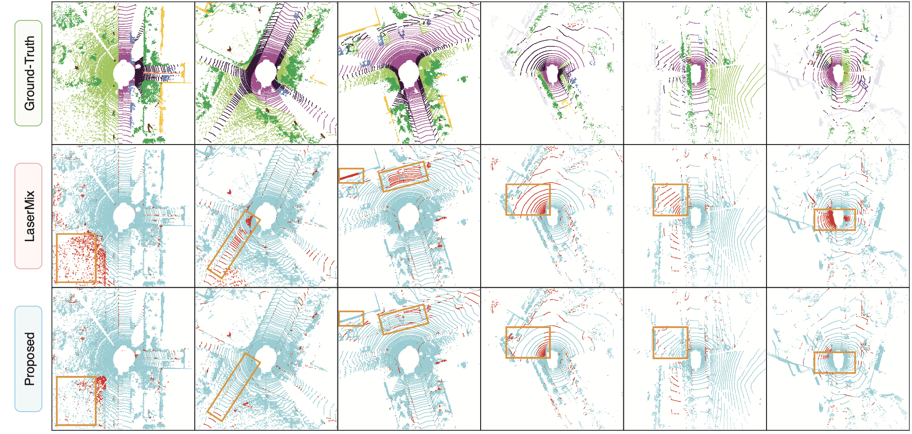

<!-- Implementation of **[HiLoTs: High-Low Temporal Sensitive Representation Learning for Semi-Supervised LiDAR Segmentation in Autonomous Driving](https://arxiv.org/abs/2503.17752)** -->

<h3 align="center"><a href="https://arxiv.org/abs/2503.17752">HiLoTs: High-Low Temporal Sensitive Representation Learning for Semi-Supervised LiDAR Segmentation in Autonomous Driving</a></h1>

<p align="center">R.D. Lin, Pengcheng Weng, Yinqiao Wang, Han Ding, Jinsong Han, Fei Wang</p>

<!-- <p align="center">School of Software Engineering, Xi'an Jiaotong University</p> -->

<!-- <p align="center">School of Computer Science and Technology, Xi'an Jiaotong University</p> -->

<!-- <p align="center">College of Computer Science and Technology, Zhejiang University</p> -->

## Introduction

In driving experience, we observe a phenomenon: objects closer to the vehicle, such as roads and cars, tend to have stable categories and shapes as the vehicle moves, while distant objects, such as pedestrians, guardrails, plants, and buildings, exhibit significant variations in category and shape. 

<p align="center"></p>
<p align="center"><i>Figure 1. Motivation</i></p>

## Methods

Our segmentation model involves three stages. During voxelization, cylindrical voxelization is applied to transform unordered points into volumetric grids, followed by a spatial feature extraction backbone. Then, HiLoTs processes the labeled and unlabeled cylindrical features through a student-teacher framework. It also integrates the attention map from HiLoTs embedding unit (HEU) to produce voxel-level segmentation maps. Finally, a point-wise refinement network is utilized to obtain point-level segmentation results. 

HEU consists of High Temporal Sensitive Flow (HTSF) and Low Temporal Sensitive Flow (LTSF). The HTSF focuses on regions where distant objects experience significant changes in category and shape, while the LTSF focuses on nearby regions where object categories and shapes remain relatively stable. Furthermore, the features from HTSF and LTSF are fused and interact through a cross-attention mechanism.

<p align="center"></p>
<p align="center"><i>Figure 2. Overall architecture</i></p>


## Main Results

### mIoU Comparisons with Other Methods

<table class="tg" style="undefined;table-layout: fixed; width: 487px"><colgroup>
<col style="width: 121px">
<col style="width: 61px">
<col style="width: 61px">
<col style="width: 61px">
<col style="width: 61px">
<col style="width: 61px">
<col style="width: 61px">
</colgroup>
<thead>
  <tr>
    <th class="tg-cly1" rowspan="2">Methods</th>
    <th class="tg-baqh" colspan="3">SemanticKITTI</th>
    <th class="tg-baqh" colspan="3">nuScenes</th>
  </tr>
  <tr>
    <th class="tg-baqh">10%</th>
    <th class="tg-baqh">20%</th>
    <th class="tg-baqh">50%</th>
    <th class="tg-baqh">10%</th>
    <th class="tg-baqh">20%</th>
    <th class="tg-baqh">50%</th>
  </tr></thead>
<tbody>
  <tr>
    <td class="tg-0lax">Cylinder3D</td>
    <td class="tg-baqh">56.1</td>
    <td class="tg-baqh">57.8</td>
    <td class="tg-baqh">58.7</td>
    <td class="tg-baqh">63.4</td>
    <td class="tg-baqh">67.0</td>
    <td class="tg-baqh">71.9</td>
  </tr>
  <tr>
    <td class="tg-0lax">RangeViT</td>
    <td class="tg-baqh">53.4</td>
    <td class="tg-baqh">56.6</td>
    <td class="tg-baqh">58.8</td>
    <td class="tg-baqh">64.6</td>
    <td class="tg-baqh">67.8</td>
    <td class="tg-baqh">73.1</td>
  </tr>
  <tr>
    <td class="tg-0lax">PolarMix</td>
    <td class="tg-baqh">60.9</td>
    <td class="tg-baqh">62.0</td>
    <td class="tg-baqh">63.8</td>
    <td class="tg-baqh">69.6</td>
    <td class="tg-baqh">71.0</td>
    <td class="tg-baqh">73.8</td>
  </tr>
  <tr>
    <td class="tg-0lax">DDSemi</td>
    <td class="tg-baqh">65.1</td>
    <td class="tg-baqh">66.3</td>
    <td class="tg-baqh">67.0</td>
    <td class="tg-baqh">70.2</td>
    <td class="tg-baqh">74.0</td>
    <td class="tg-baqh">76.5</td>
  </tr>
  <tr>
    <td class="tg-0lax">HiLoTs (ours)</td>
    <td class="tg-baqh">65.7</td>
    <td class="tg-baqh">66.5</td>
    <td class="tg-baqh">67.6</td>
    <td class="tg-baqh">72.2</td>
    <td class="tg-baqh">75.2</td>
    <td class="tg-baqh">76.9</td>
  </tr>
</tbody></table>


### Visualization Examples

The left three columns are segmentation results from SemanticKITTI dataset, while the right three columns are from nuScenes. Our HiLoTs method shows a significant improvement in the area of distant objects.

<p align="center"></p>
<!-- <p align="center"><i>Figure 1. Motivation</i></p> -->


## Implementation

### Package Requirements

The code is tested under ``
python==3.10.0, torch==1.10.0, mmcv==2.0.0rc4, mmdet3d==1.2.0, mmengine==0.8.4
``. Later version of the above packages should also work well. 


### Code Structure

The following files contain the config detail of HiLoTs, implementation of HiLoTs Embedding Unit (HEU) and overall architecture of the model. 

```
configs
| hilots

mmdet3d
| models
| | backbones
| | | minkunet_backbone.py
| | segmentors
| | | hilots.py
| | voxel_encoders
| | | voxel_encoder.py
```

<!-- Model training: -->
### Training the Model

Our model is trained with standard training strategy of ``mmengine``, which can be done by the following command:
```
python tools/train.py {config_file}
```
For multi-GPU training, use the command:
```
tools/dist_train.sh {config_file} {gpu_num}
```
For example, training HiLoTs with 10% SemanticKITTI on 4 GPU:
```
tools/dist_train.sh configs/hilots/hilots_semantickitti_10.py 4
```

### Testing the Model

Similar to training, testing the model performance can be done with the following command:
```
python tools/test.py {config_file} {model_weight_file}
```
Testing with multi-GPU:
```
tools/dist_test.sh {config_file} {model_weight_file} {gpu_num}
```

### Visualization of Point Cloud Segmentation
The segmentation visualization of a trained model can be done by the following command:
```
python tools/test.py {config_file} {model_weight_file} --show --show-dir ./visualize_result --task lidar_seg
```
Check out ``mmdet3d/visualization/local_visualizer.py`` if you want to customize your visualization results. 


## Acknowledgement

This project is developed based on <a href="https://github.com/open-mmlab/mmdetection3d">MMDetection3D</a> and <a href="https://github.com/ldkong1205/LaserMix">LaserMix</a>. MMDetection3D is an open source object detection toolbox based on PyTorch, towards the next-generation platform for general 3D detection. It is a part of the <a href="https://openmmlab.com/">OpenMMLab</a> project. <a href="https://github.com/ldkong1205/LaserMix">LaserMix</a> is a semi-supervised learning framework designed for LiDAR semantic segmentation. It leverages the strong spatial prior of driving scenes to construct low-variation areas via laser beam mixing, and encourages segmentation models to make confident and consistent predictions before and after mixing.


## Citation
